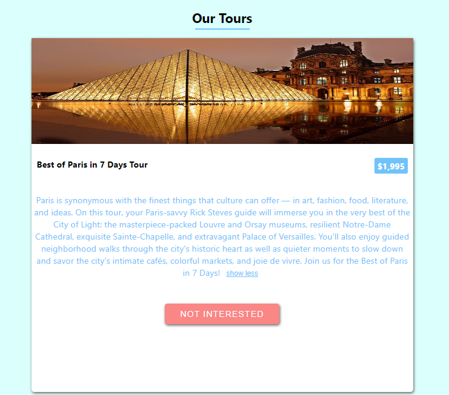
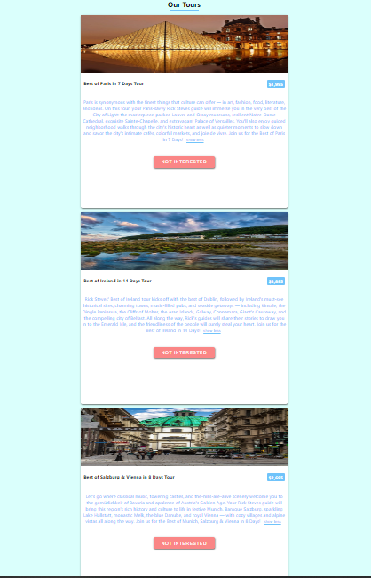
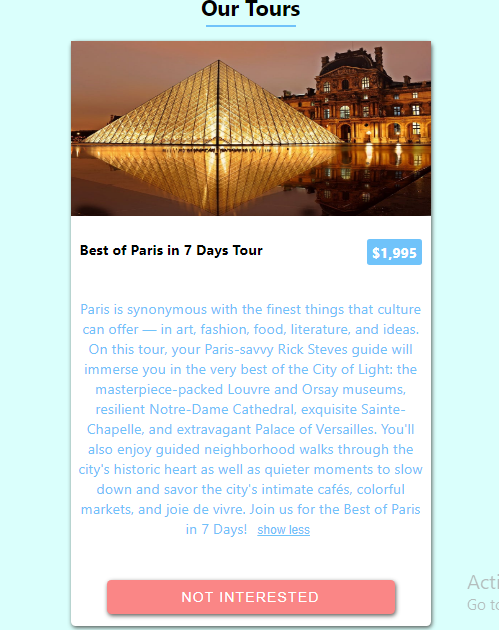
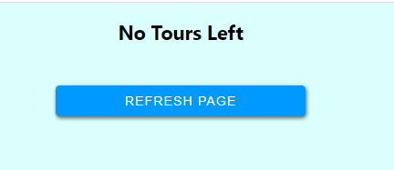

Another Project developed during the course of learning more about the React Library is
the minor project about Tours. was able to make use of the useState and useEffect of the React
hook.

below is the design of the tours project using React and vanilla Css

